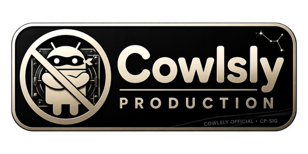

  

# cowlsly_console_simple_settings_repo_03

Cowlsly Simple Settings is the shared settings module for the Cowlsly Console suite.

Cyberpunk UI in this repo follows the Cowlsly design language: neon glass panels over the **forever-turning cog machine** background (`assets/branding/cowlsly_cogs_background_animated.svg`). See `Cowlsly/BRANDING.md`.

## Current status

Planning / quick-win build. Phase 1 assets are in place.

## Phase 1 intent

- Shared app settings module.
- CASMEA information entry screen.
- Controlled developer shortcut after access is granted.

## Documents

- `ROADMAP.md` — active build roadmap for this repo.
- `dev/dat/doc/ROADMAP.ORIGINAL.md` — founding context and rebuild notes.
- `assets/README.md` — asset naming, folder layout, and Phase 1 catalog.
- `assets/ASSET_MANIFEST.md` — labeled asset index with phase mapping.
- `assets/branding/README.md` — shared Cowlsly logo and cogs background kit.
- `Cowlsly/BRANDING.md` — suite-wide branding rules (logo + forever-turning machine).
- `Cowlsly/SUMMARY.md` — table of contents for this repo.